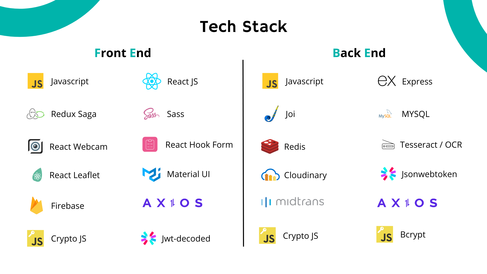

## Slaapdoss Booking Cabin

#### Ergonomic lodging solutions that blend with nature.

Web Site Aplication for making cabin reservations with guaranteed security and UI/UX that is simple and easy to use

> **Note**
>
> This project is no longer being worked on. This branch repo only serves to give inspiration to others as a point in time reference.

## Stack

This project is no longer being worked on. This branch repo only serves to provide inspiration to others as a reference.:

- **Front-end** - React.js as the core library, Material UI for UI Framwork, Redux with Redux-Saga for State Management, Sass for styling, RHF, React-Leaflet for rendering map with open street map, axis for faching data.
- **Back-end** - Express.js as the core framework, Joi validation, MYSQL as the core Database, Redis for chaching, Cloudinary for cloud image, Tesseract for OCR, Midtrans for payment gateway, crypto.js for encryption payload

##

### Feature Highlights

##

### Back-end

Back-end program flow as a microservice
:

### Front-end

Front-end program flow
:

## License Summary

This sample code is made available under the Noncommercial Use License (Version 1.0). See the LICENSE file.
